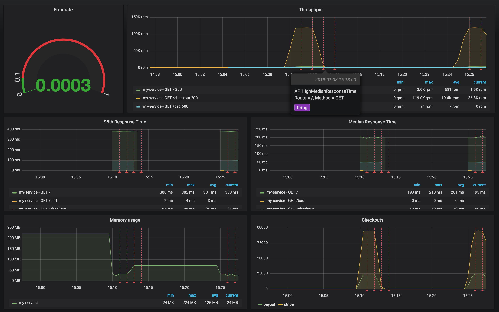

### Deploy a local Prometheus and Grafana stack with Docker Compose

During this lab we will run the Prometheus and Grafana in  Docker Compose.
Configuration for this lab is based on [https://github.com/vegasbrianc/prometheus](https://github.com/vegasbrianc/prometheus).
In the lab VM the Prometheus docker compose project was cloned to `/root/prometheus`.

1). Add the scraping job definition to the Prometheus configuration file `/root/prometheus/prometheus/prometheus.yml` by adding (uncommenting in the lab VM) the following code within `scrape_config` section:

```
  - job_name: 'btm-nodejs'
    scrape_interval: 20s
    static_configs:
    - targets: ['xxx.xxx.xxx.xxx:3001']
      labels:
        service: 'btm-nodejs'
        group: 'production'

```
replace xxx.xxx.xxx.xxx with your own host machine's IP. In the Skytap lab VM, the IP address should be `10.0.0.1`.

2). Start Prometheus & Grafana stack:
   
```
cd /root/prometheus
docker-compose up -d
```
Expected output:
```
Creating network "prometheus_back-tier" with the default driver
Creating network "prometheus_front-tier" with the default driver
Creating prometheus_cadvisor_1      ... done
Creating prometheus_alertmanager_1  ... done
Creating prometheus_node-exporter_1 ... done
Creating prometheus_prometheus_1    ... done
Creating prometheus_grafana_1       ... done

```

Verify that Prometheus server was started via: [http://localhost:9090](http://localhost:9090/graph)
Check the status of scraping targets in Prometheus UI -> Status -> Targets 

## Run example PromQL queries

Generate some application load before running the queries:

```
cd ~/b2m-nodejs/src/
./load_test.sh
```

Run the following example PromQL queries using the Prometheus UI.

### Throughput

#### Error rate

Range[0,1]: number of 5xx requests / total number of requests

```
sum(increase(http_request_duration_ms_count{code=~"^5..$"}[1m])) /  sum(increase(http_request_duration_ms_count[1m]))
```

Expected value `~0.2` because our application should return 500 for about 20% of transactions.

#### Request Per Minute

```
sum(rate(http_request_duration_ms_count[1m])) by (service, route, method, code)  * 60
```
Check the graph.

### Response Time

#### Apdex

[Apdex](https://en.wikipedia.org/wiki/Apdex) score approximation: `100ms` target and `300ms` tolerated response time

```
(sum(rate(http_request_duration_ms_bucket{le="100"}[1m])) by (service) + sum(rate(http_request_duration_ms_bucket{le="300"}[1m])) by (service)
) / 2 / sum(rate(http_request_duration_ms_count[1m])) by (service)
```

> Note that we divide the sum of both buckets. The reason is that the histogram buckets are cumulative. The le="100" bucket is also contained in the le="300" bucket; dividing it by 2 corrects for that. - [Prometheus docs](https://prometheus.io/docs/practices/histograms/#apdex-score)

#### 95th Response Time

```
histogram_quantile(0.95, sum(rate(http_request_duration_ms_bucket[1m])) by (le, service, route, method))
```

#### Median Response Time

```
histogram_quantile(0.5, sum(rate(http_request_duration_ms_bucket[1m])) by (le, service, route, method))
```

#### Average Response Time

```
avg(rate(http_request_duration_ms_sum[1m]) / rate(http_request_duration_ms_count[1m])) by (service, route, method, code)
```


### Memory Usage

#### Average Memory Usage

In Megabytes.

```
avg(nodejs_external_memory_bytes / 1024 ) by (service)
```

## Configure Prometheus alert
Alerting rules allows to define alert conditions based on Prometheus expression language expressions and to send notifications about firing alerts to an external service. In this lab we will configure one alerting rule for median response time higher than 100ms.

**Lab instruction:**

Add the following alert rule to the `alert.rules` file. In the lab VM it is located in `/root/prometheus/prometheus/alert.rules`

```
  - alert: APIHighMedianResponseTime
    expr: histogram_quantile(0.5, sum by(le, service, route, method) (rate(http_request_duration_ms_bucket[1m])))
      > 30
    for: 1m
    annotations:
      description: '{{ $labels.service }}, {{ $labels.method }} {{ $labels.route }}
        has a median response time above 100ms (current value: {{ $value }}ms)'
      summary: High median response time on {{ $labels.service }} and {{ $labels.method
        }} {{ $labels.route }}
```

Restart the Prometheus stack:

```
cd ~/prometheus
docker-compose down
docker-compose up -d
```

Alerts can be listed via Prometheus UI: [http://localhost:9090/alerts](http://localhost:9090/alerts)

States of active alerts: 

- `pending`:


- `firing`:


## Set the Prometheus datasource in Grafana

Logon to Grafana via `http://localhost:3000`
- user: admin
- password: foobar

Verify the prometheus datasource configuration in Grafana. If it was not already configured, [create](http://docs.grafana.org/features/datasources/prometheus/#adding-the-data-source-to-grafana) a Grafana datasource with these settings:

+ name: Prometheus
+ type: prometheus
+ url: http://localhost:9090
+ access: browser


## Configure dashboard

Grafana Dashboard to [import](http://docs.grafana.org/reference/export_import/#importing-a-dashboard): `~/b2m-nodejs/src/btm-nodejs-grafana.json`

Monitoring dashboard was created according to the RED Method principles:

- Rate (`Thoughput` and `Checkouts` panels)
- Errors (`Error rate` panel)
- Duration (`95th Response Time` and `Median Response Time` panels)



Review the configuration of each dashboard panel. Check the [annotation](http://docs.grafana.org/reference/annotations/) settings.

Define the [Apdex](https://en.wikipedia.org/wiki/Apdex) score chart using the following query:

```
(sum(rate(http_request_duration_ms_bucket{le="100"}[1m])) by (service) + sum(rate(http_request_duration_ms_bucket{le="300"}[1m])) by (service)
) / 2 / sum(rate(http_request_duration_ms_count[1m])) by (service)
```
You can add it to the existing dashboard:

- Click on the icon `Add panel` and select `Graph` panel type. 
- Click on the panel title and select edit.
- Select `Prometheus` datasource in the `Metrics` tab of the panel query editor
- Copy PromQL to the free form field
- Verify the results on the panel preview
- Explore other Graph panel options
   
Every time you need to generate an application traffic, use provided script `~/b2m-nodejs/src/load_test.sh`